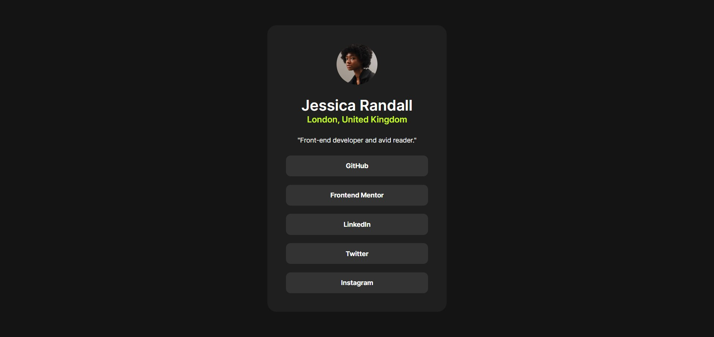

# Social Links Profile — Frontend Mentor Challenge Solution

[](https://async-kita.github.io/social-links-profile/)
[](https://html.spec.whatwg.org/)
[](https://www.w3.org/Style/CSS/)



## 📖 Overview

This is a fully responsive social links profile card. It was built as a solution to the [Social links profile challenge on Frontend Mentor](https://www.frontendmentor.io/challenges/social-links-profile-UG32l9m6dQ).  
The goal was to replicate the provided design as closely as possible and implement proper hover/focus states for all interactive elements.

**Live demo:** [https://async-kita.github.io/social-links-profile/](https://async-kita.github.io/social-links-profile/)

## 🚀 Built with

- Semantic **HTML5**
- **Flexbox** layout
- **CSS Custom Properties** (variables for the color scheme)
- Responsive typography using `clamp()`
- Local **Inter** font files loaded via `@font-face`
- **BEM** naming convention
- Accessibility: focus-visible styles for keyboard navigation

## ✨ Features

- **Fully responsive** – the card adapts perfectly to mobile (≤768px) and desktop screens.
- **Interactive states** – links change background and text color on hover (if the device supports hover) and have a clear visual indicator on focus.
- **Optimized fonts** – only the required weights (400, 600, 700) are loaded with `font-display: swap`.
- **Clean, maintainable code** – minimal duplication, all styles in one file.

## 🖱️ Interactive states behaviour

| State | Appearance |
|-------|------------|
| Default | Dark grey background (`--grey-700`), white text |
| Hover (on devices with a mouse) | Bright green background (`--color-green`), near‑black text |
| Focus-visible | Green outline around the link with 2px offset |

## 📱 Responsive adjustments

- Base font size: `0.875rem` (desktop) → `0.75rem` (small screens) – smoothly interpolated via `clamp()`.
- Card inner padding: `24px` on mobile, `40px` on desktop.
- Gap between links: decreases from `18px` to `11px` at 768px breakpoint.

## 🔧 Run locally

Because the project consists only of static files (HTML, CSS, fonts, images), simply clone the repository and open `index.html` in your browser:

```bash
git clone https://github.com/async-kita/social-links-profile.git
cd social-links-profile
# then open index.html